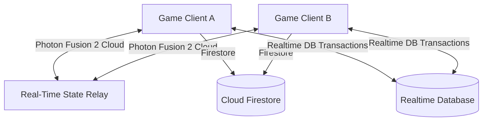

# Technical Architecture - Puzzle Pals Adventure

This document outlines the client-driven serverless architecture designed to run Puzzle Pals Adventure entirely on the **100% Free Firebase Spark Plan** combined with the **Photon Fusion 2 Cloud**.

---

## 1. High-Level Architecture Overview

---

## 2. Serverless Multiplayer Matchmaking

Under the free Firebase Spark Plan, there are no custom backend servers or Cloud Functions. We utilize **Firebase Realtime Database (RTDB) Transactions** directly from the clients to ensure atomic queue management:

1. **Querying Tickets**: When a player clicks "Online Play", the client queries `/matchmaking_queue` to list waiting rooms.
2. **Atomic Claiming**: If tickets are found, the client attempts to claim a ticket using a transaction block on `/matchmaking_queue/{ticketId}`.
   - If the transaction succeeds, the status shifts to `matched`. The claimant reads the host's room code and joins the Photon session.
   - If the transaction fails (e.g. another player claimed it first), the client retries with the next ticket or hosts.
3. **Hosting Tickets**: If no ticket is available, the client writes a ticket containing their own `userId` and a generated `roomCode` to `/matchmaking_queue/{myUserId}`, then listens to that node. When an opponent links up, the host starts the Photon room.

---

## 3. Network State & Authority (Photon Fusion 2)

Photon Fusion 2 handles real-time positions, physical interaction triggers, and emotes:

- **State Authority**: The creator of a physics object (or the player holding it) holds state authority.
- **Input Authority**: Each client has input authority over their own character controller.
- **Networked Properties**: Puzzle gates and levers use the `[Networked]` attribute to sync positions and triggers.
- **RPC Emotes**: Player emotes use RPCs (`Rpc_TriggerEmote`) to display chat emojis above character models on remote clients.

---

## 4. Persistent Cloud Saves

Firestore acts as our cloud save mechanism:
- User records are stored at `users/{userId}` containing stats (coins, gems, achievements) and unlocked levels.
- Client writes changes to Firestore upon level completion.
- Firestore Security Rules enforce that clients can only update documents corresponding to their authenticated UID.
